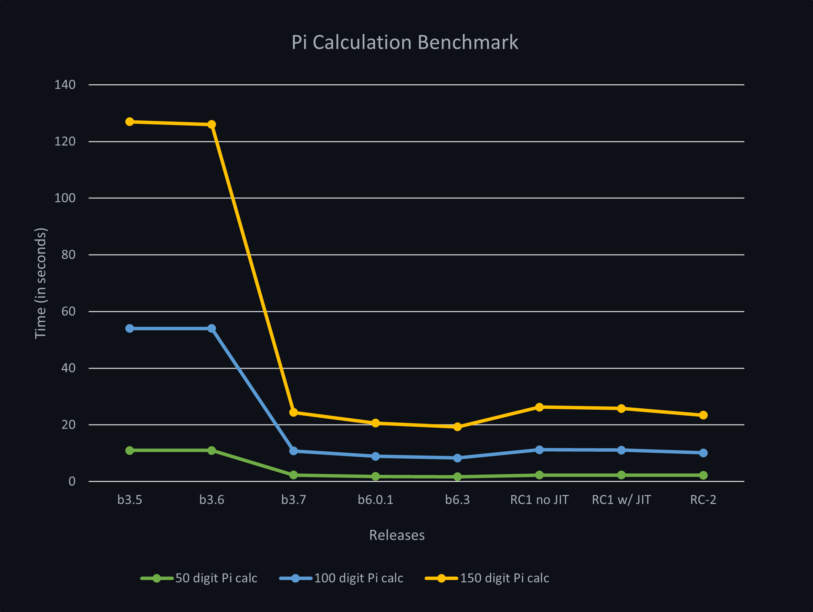
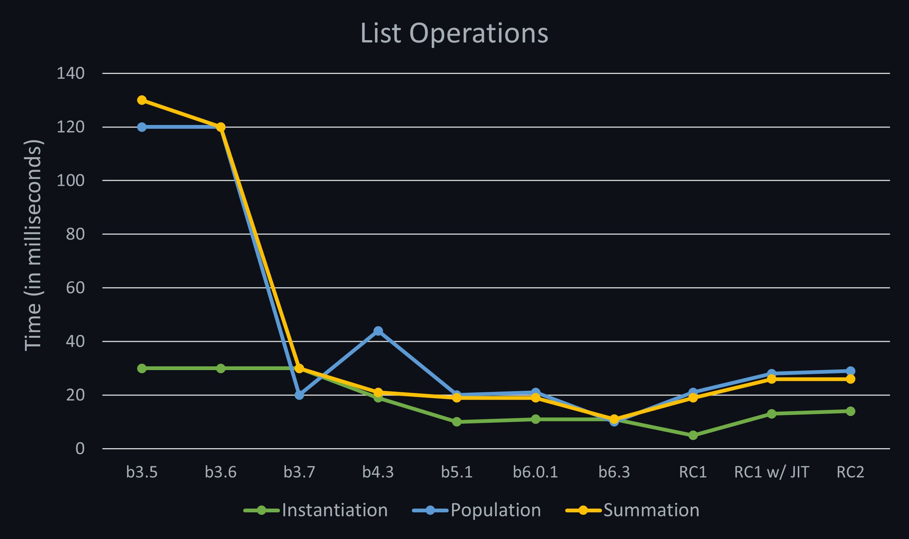
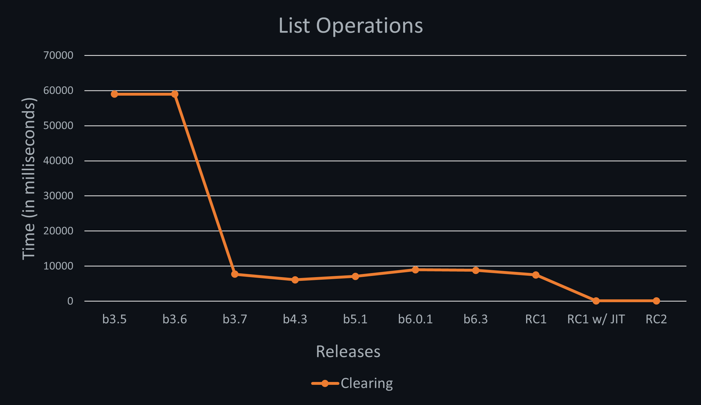

# Meadow Performance Benchmarks

Contains applications that measure the performance of Meadow, as well as the results of those tests.

This is primarily to track the progress of our performance improvements.

To validate, make sure to run application in `release` mode.

**Please Note** - Small variances will occur between runs and between boards.

## Benchmark Results

### Pi Calculation

Calculates pi (`3.14159..`) to [`x`] digits and records the amount of time it takes. Here are the results per release update:

| Operation          | **b3.5**   | **b3.6**   | **b3.7**   | **b6.0.1** | **b6.3**   | **RC1 no JIT** | **RC1 w/ JIT** | **RC-2** |
|--------------------|------------|------------|------------|------------|------------|----------------|----------------|----------|
| 50 digit Pi   | `11s`      | `11s`      | `2.3s`     | `1.8s`     | `1.7s`     | `2.3s`         | `2.3s`         | `2.2s`   |
| 100 digit Pi  | `54s`      | `54s`      | `10.8s`    | `8.9s`     | `8.3s`     | `11.2s`        | `11.1s`        | `10.1s`  |
| 150 digit Pi  | `127s`     | `126s`     | `24.4s`    | `20.6s`    | `19.3s`    | `26.3s`        | `25.8s`        | `23.4s`  |

 
### List Operations

Create a 1,000 item `List<int>`, and do perform basic list operations on it.

| Operation          | **b3.5**   | **b3.6**   | **b3.7**   | **b4.3**   | **b5.1**   | **b6.0.1** | **b6.3**   | **RC1 no JIT** | **RC1 w/ JIT** | **RC-2** |
|--------------------|------------|------------|------------|------------|------------|------------|------------|----------------|----------------|----------|
| Instantiation | `30ms`     | `30ms`     | `30ms`     | `19ms`     | `10ms`     | `11ms`     | `11ms`     | `5ms`          | `13ms`         | `14ms`   |
| Population    | `120ms`    | `120ms`    | `20ms`     | `44ms`     | `20ms`     | `21ms`     | `10ms`     | `21ms`         | `28ms`         | `29ms`   |
| Summation     | `130ms`    | `120ms`    | `30ms`     | `21ms`     | `19ms`     | `19ms`     | `11ms`     | `19ms`         | `26ms`         | `26ms`   |

| Operation          | **b3.5**   | **b3.6**   | **b3.7**   | **b4.3**   | **b5.1**   | **b6.0.1** | **b6.3**   | **RC1 no JIT** | **RC1 w/ JIT** | **RC-2** |
|--------------------|------------|------------|------------|------------|------------|------------|------------|----------------|----------------|----------|
| List clearing      | `59s`      | `59s`      | `7.7s`     | `6.1s`     | `7.1s`     | `9.0s`     | `8.8s`     | `7.5s`         | `115ms`        | `130ms`  |

### Digital Output Port Operations

Initializes three `DigitalOutputPort` instances, one for each of the onboard LED components and 
writes to them.

| Operation              | **b3.5**  | **b3.6**  | **b3.7**  | **b4.3**  | **b5.1**  | **b6.0.1** | **b6.3**   | **RC1 no JIT** | **RC1 w/ JIT** | **RC-2** |
|------------------------|-----------|-----------|-----------|-----------|-----------|------------|------------|----------------|----------------|----------|
| Port initialization    | `2.7s`    | `2.8s`    | `2.0s`    | `0.5s`    | `0.45s`   | `0.46s`    | `0.47s`    | `0.48s`        | `0.74s`        | `0.704s` |
| 300 Port writes        | `48s`     | `13s`     | `0.15s`   | `1.4s`    | `1.33s`   | `0.15s`    | `0.14s`    | `0.14s`        | `0.05s`        | `0.05s`  |
| Average time per write | `159ms`   | `42ms`    | `0.5ms`   | `0.5ms`   | `0.44ms`  | `0.51ms`   | `0.46ms`   | `0.47ms`       | `0.16ms`       | `0.17ms`  |

### SoftPwmGeneration

Generates a PWM signal in software. Currently is a visual test. Run the test and note which was 
the last frequency change that was noticeable.

| Operation                        | **b3.5** | **b3.6** | **b3.7** | **b4.3** | **b5.1** | **b6.0.1** | **b6.3**   | **RC1 no JIT** | **RC1 w/ JIT** |
|----------------------------------|----------|----------|----------|----------|----------|------------|------------|----------------|----------------|
| Maximum Frequency @ `50%` duty   | ~`50hz`  | ~`50hz`  | ~`100hz` | ~`100hz` | ~`100hz` | ~`100hz`   | ~`100hz`   |  ~`100Hz`      | ~`1500Hz`      |
