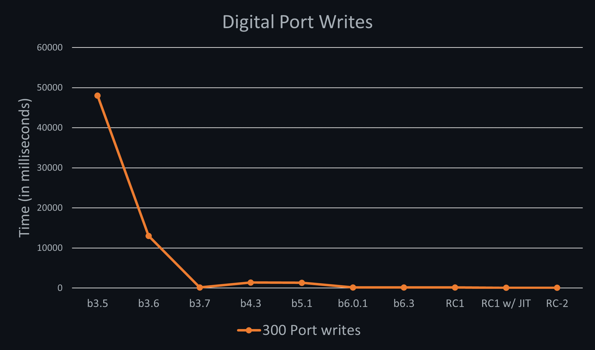
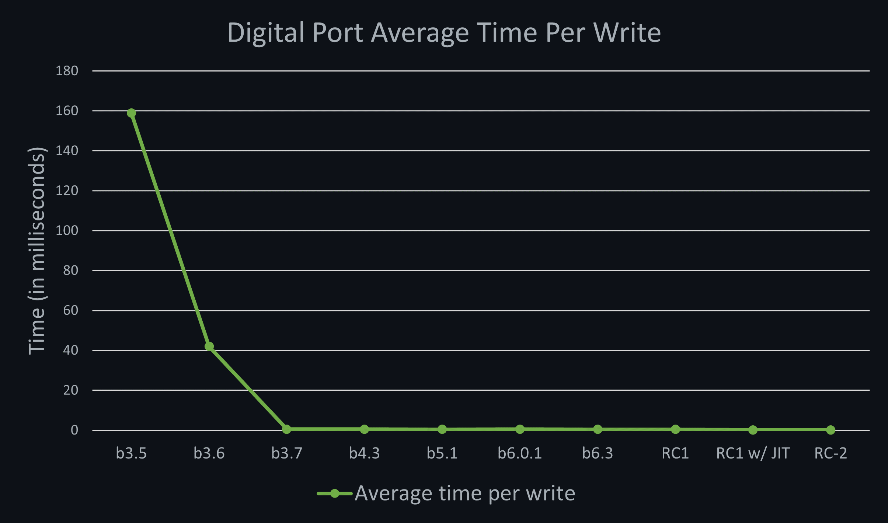
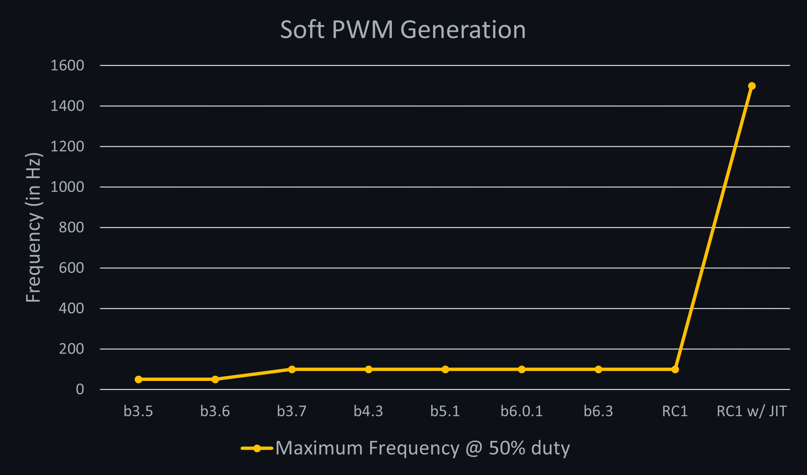

# Meadow Performance Benchmarks

Contains applications that measure the performance of Meadow, as well as the results of those tests.

This is primarily to track the progress of our performance improvements.

To validate, make sure to run application in `release` mode.

**Please Note** - Small variances will occur between runs and between boards.

## Benchmark results

Below this markdown you will see the kinds of tests we perform on our boards to benchmark its performance for each release.

* [Pi Calculation](#pi-calculation)
* [List Operations](#list-operations)
* [Digital Output Operations](#digital-output-port-operations)
* [Soft PWM](#softpwmgeneration)

## Pi Calculation

Calculates pi (`3.14159..`) to [`x`] digits and records the amount of time (in seconds) it takes. Here are the results per release update:

| Operation              | **b3.5**   | **b3.6**   | **b3.7**   | **b6.0.1** | **b6.3**   | **RC1**   | **RC1 w/ JIT** | **RC-2** |
|------------------------|------------|------------|------------|------------|------------|-----------|----------------|----------|
| Calculate 50 digits    | `11s`      | `11s`      | `2.3s`     | `1.8s`     | `1.7s`     | `2.3s`    | `2.3s`         | `2.2s`   |
| Calculate 100 digits   | `54s`      | `54s`      | `10.8s`    | `8.9s`     | `8.3s`     | `11.2s`   | `11.1s`        | `10.1s`  |
| Calculate 150 digits   | `127s`     | `126s`     | `24.4s`    | `20.6s`    | `19.3s`    | `26.3s`   | `25.8s`        | `23.4s`  |

 
## List Operations

Create a 1,000 item `List<int>`, and do perform basic list operations on it.

| Operation          | **b3.5**   | **b3.6**   | **b3.7**   | **b4.3**   | **b5.1**   | **b6.0.1** | **b6.3**   | **RC1**   | **RC1 w/ JIT** | **RC-2** |
|--------------------|------------|------------|------------|------------|------------|------------|------------|-----------|----------------|----------|
| Instantiation      | `30ms`      | `30ms`      | `30ms`      | `19ms`      | `10ms`      | `11ms`      | `11ms`      | `5ms`      | `13ms`          | `14ms`    |
| Population         | `120ms`     | `120ms`     | `20ms`      | `44ms`      | `20ms`      | `21ms`      | `10ms`      | `21ms`     | `28ms`          | `29ms`    |
| Summation          | `130ms`     | `120ms`     | `30ms`      | `21ms`      | `19ms`      | `19ms`      | `11ms`      | `19ms`     | `26ms`          | `26ms`    |

| Operation          | **b3.5**   | **b3.6**   | **b3.7**   | **b4.3**   | **b5.1**   | **b6.0.1** | **b6.3**   | **RC1** | **RC1 w/ JIT** | **RC-2** |
|--------------------|------------|------------|------------|------------|------------|------------|------------|---------|----------------|----------|
| Clearing           | `59000ms`   | `59000ms`   | `7700ms`    | `6100ms`    | `7100ms`    | `9000ms`    | `8800ms`    | `7500ms` | `115ms`         | `130ms`   |

## Digital Output Port Operations

Initializes three `DigitalOutputPort` instances, one for each of the onboard LED components and 
writes to them.

| Operation              | **b3.5**  | **b3.6**  | **b3.7**  | **b4.3**  | **b5.1**  | **b6.0.1** | **b6.3**   | **RC1**    | **RC1 w/ JIT** | **RC-2** |
|------------------------|-----------|-----------|-----------|-----------|-----------|------------|------------|------------|----------------|----------|
| Port initialization    | `2700ms`   | `2800ms`   | `2000ms`   | `500ms`    | `450ms`    | `460ms`     | `470ms`     | `480ms`     | `740ms`         | `704ms`   |

| Operation              | **b3.5**  | **b3.6**  | **b3.7**  | **b4.3**  | **b5.1**  | **b6.0.1** | **b6.3**   | **RC1**    | **RC1 w/ JIT** | **RC-2** |
|------------------------|-----------|-----------|-----------|-----------|-----------|------------|------------|------------|----------------|----------|
| 300 writes             | `48000ms`  | `13000ms`  | `150ms`    | `1400ms`   | `1330ms`   | `150ms`     | `140ms`     | `140ms`     | `50ms`         | `50ms`    |

| Operation              | **b3.5**  | **b3.6**  | **b3.7**  | **b4.3**  | **b5.1**  | **b6.0.1** | **b6.3**   | **RC1**    | **RC1 w/ JIT** | **RC-2** |
|------------------------|-----------|-----------|-----------|-----------|-----------|------------|------------|------------|----------------|----------|
| Avg time per write     | `159ms`    | `42ms`     | `0.5ms`    | `0.5ms`    | `0.44ms`   | `0.51ms`    | `0.46ms`    | `0.47ms`    | `0.16ms`        | `0.17ms`  |

## Soft PWM Generation

Generates a PWM signal in software. Currently is a visual test. Run the test and note which was 
the last frequency change that was noticeable.

| Operation                        | **b3.5** | **b3.6** | **b3.7** | **b4.3** | **b5.1** | **b6.0.1** | **b6.3**   | **RC1**   | **RC1 w/ JIT** |
|----------------------------------|----------|----------|----------|----------|----------|------------|------------|-----------|----------------|
| Maximum Frequency @ `50%` duty   | ~`50hz`  | ~`50hz`  | ~`100hz` | ~`100hz` | ~`100hz` | ~`100hz`   | ~`100hz`   |  ~`100Hz` | ~`1500Hz`      |

